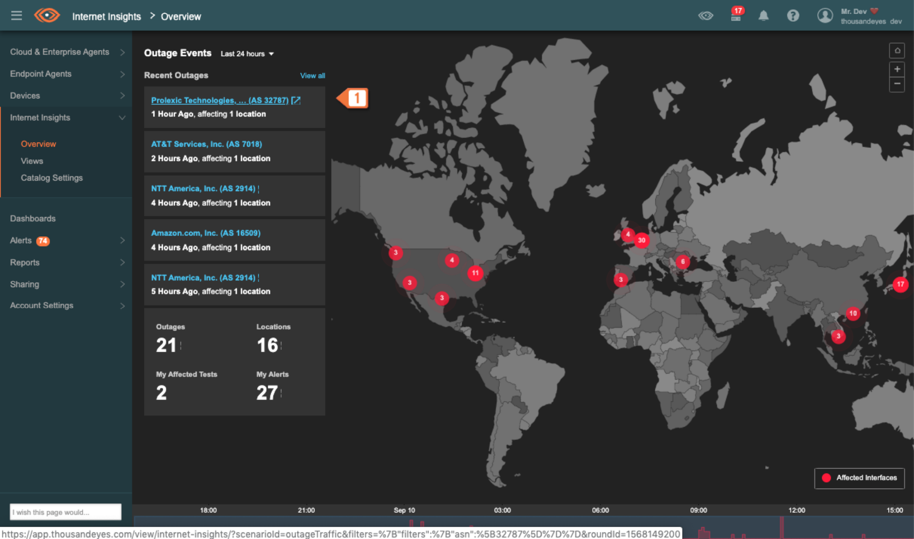
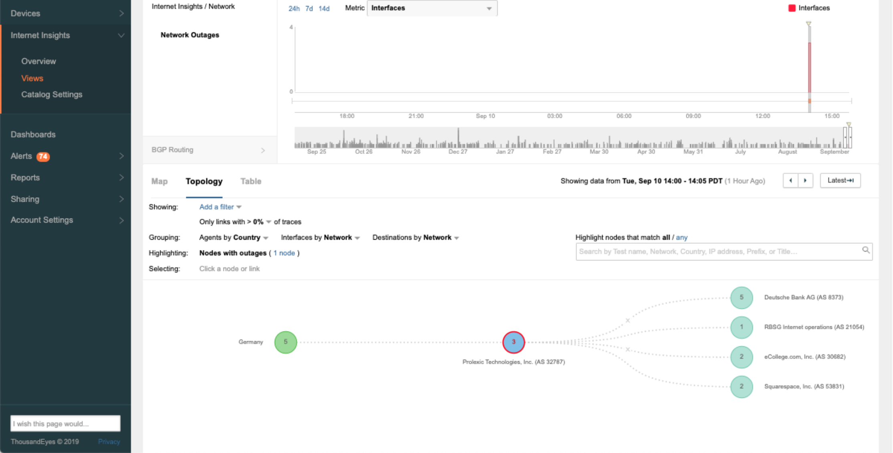
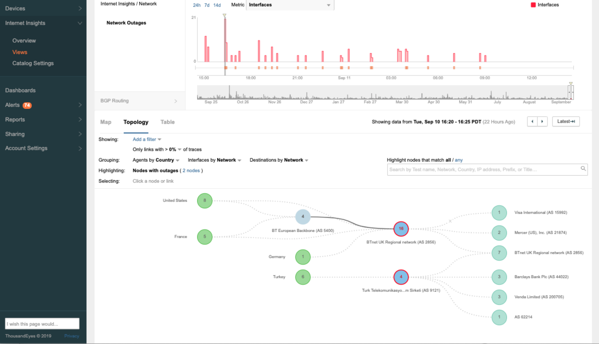
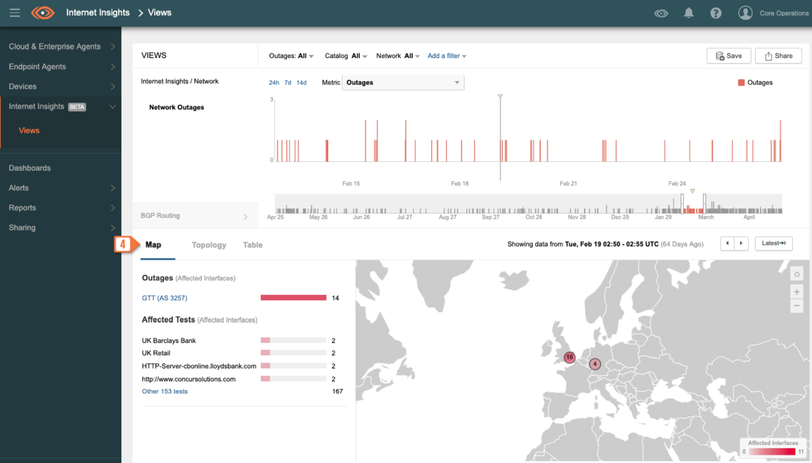
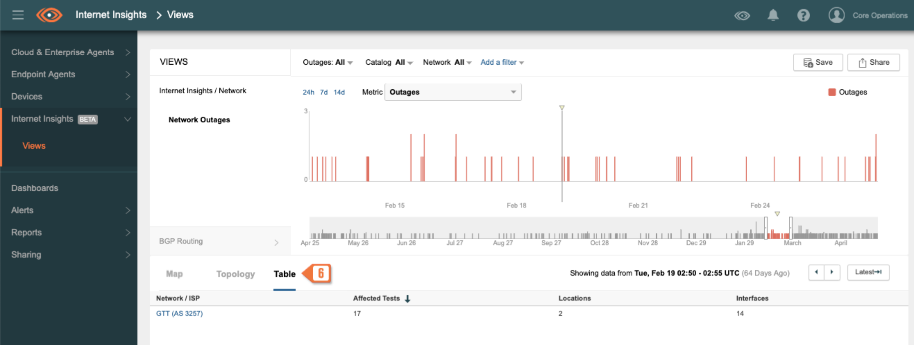
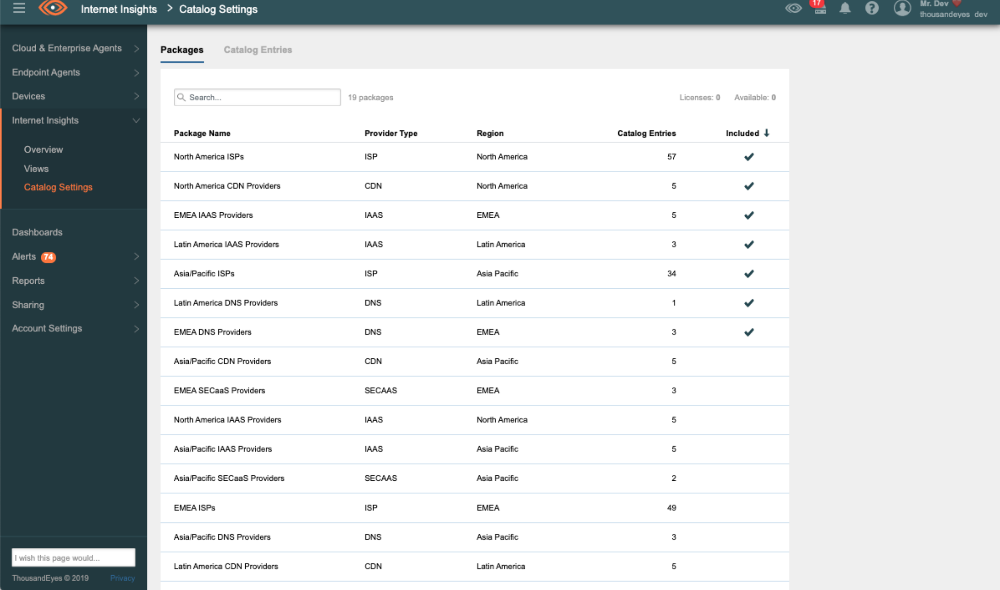

# Internet Insights

Internet Insights allows a user to monitor the state of the network infrastructure worldwide, identify bottlenecks, and find solutions to issues that arise.

Internet Insights can detect Outages such as routing hijacks and leaks, DDoS attacks, political interference, and custom events based on specific criteria. We define Outages as events that happen on a particular network at a particular point in time.

In addition, a user can track the state of ISPs, DNS providers, IaaS, CDNs, and SaaS providers.

Our service also gives a user geographical and topological maps of the network. They display the location of network nodes and how packets go between them. We use Cloud and Enterprise Agents to isolate an Outage to a specific Autonomous System or geographical location.

## Dashboards

The **Internet Insights** section consists of the following dashboards: **Overview**, **Views**, and **Catalog Settings**.

### Overview

This dashboard overlays recent and ongoing Outages on a global map.

A link in the list navigates you to details on the selected Outage. You can also click a location on the map to obtain a list of related Outages. The dashboard also displays a summary and timeline. 

### Views

This dashboard displays selected/filtered Outages. You can filter them by network, location, impacted service, and relevance to user account tests.

At the top, the dashboard displays the Outages on a timeline. At the bottom, the Outages are displayed on a geographical or topological map, or within a table, depending on the selected tab.

#### Topology Tab

The **Topology** tab depicts network paths. They show how traffic flows from a source to a destination. The map indicates which of these nodes are disrupted. A node can display a context menu that contains additional information.

Source nodes are aggregated by location. The IP address and domain name are not displayed. The context menu shows the number of affected Agents.

Intermediate nodes display Autonomous System Numbers (ASN). The context menu shows the number of affected destinations and allows you to access the list of affected Tests.

> To determine the affected AS, we use the target IP address and public rDNS rather than the target domain name.

Target nodes show the number of affected Tests and the Autonomous System Number. The context menu shows the number of affected destinations and allows you to access the list of affected Tests.

#### Map Tab

This tab displays the selected Outages on a geographical map. On this tab, you can...

#### Table Tab

The **Table** tab displays selected Outages in a tabular format. This tab allows you to...

### Catalog Settings

This dashboard displays service providers grouped by type and region. Here you can...

> Private data (such as IP addresses) is de-identified and aggregated.

## Data-as-a-Service Offering

We aggregate data from our Agents and Tests running across the public Internet ("Internet Insights Packages"). Cisco may discontinue or modify Internet Insights Packages at any time.

For more information on our Data-as-a-Service offering, see the DaaS Order Form Supplement.

## See Also

Outage Detection Overview

Detecting Outages in Routing Data

Terminal Interface Context