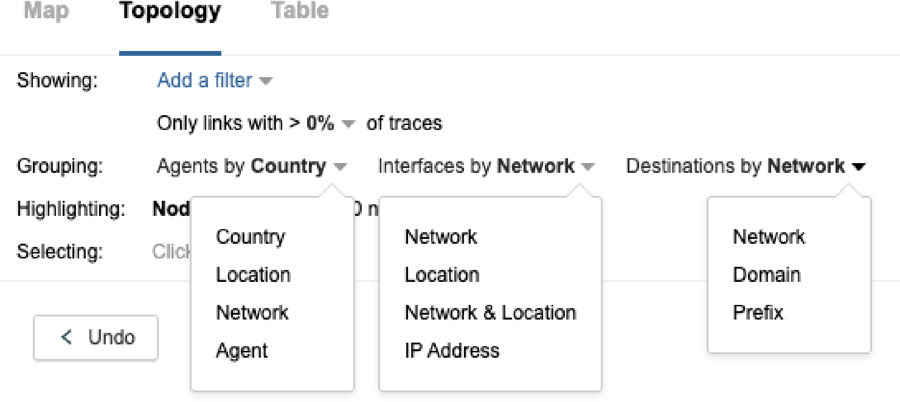

# Internet Insights

To present a more global view of outages across the ThousandEyes monitoring platform, Internet Insights provides visibility into core Internet Infrastructure and traces the impact of macro scale Internet events to individual users and enterprise networks at their edge devices. This visibility includes ISPs, DNS providers, IaaS, CDNs, and SaaS providers. Internet events include outages, routing hijacks and leaks, DDoS attacks, political interference, as well as other events that fulfill ThousandEyes' detection criteria. The vision is to provide maps of Internet Infrastructure where packets and links between routers are represented geographically.

Detection of traffic outages is based on the path trace data collected by the Cloud and Enterprise Agents.

Internet Insights provides users with a macro view of network outages using ThousandEyes agent data to isolate outage behavior to specific Autonomous Systems and locations presented in a topological view. Internet Insights is accessible from the link on the left hand side menu of the ThousandEyes Platform. There are three views available under that menu:
* **Overview:** This dashboard superimposes recent and ongoing outages onto a global map. The most recent outages are listed along with a geographical distribution of affected interfaces. Select **Internet Insights > Overview**
* **Views:** This outage timeline charts outage events in a timeline which can be filtered by network, location, impacted service and relevance to a user account tests. A topology depicts services paths, showing source and destination traffic flows and indicates which ones are being disrupted. Location and source of intervening outages are shown in this view under the Topology tab. Select **Internet Insights > Views**
* **Catalog Settings:** Provider Catalogs are listed under **Internet Insights > Catalog Settings**. Here Service providers are grouped by region. Public data from the catalog is exposed. Private IPs are not exposed and are de-identified and aggregated.

For more information about using Internet Insights contact your ThousandEyes Account Management team members.

## Overview Screen

The Internet Insights Overview Screen is accessible by navigating to **Internet Insights > Overview**.

1. **Recent Outages:** List of most recent outages. Click the Blue highlighted text to navigate to the View screen for that network outage. By detecting traces that don't reach their intended target we can infer that there's something wrong going on somewhere in the path. We define outages as events that happen on a particular network in a particular point in time.
2. **View all link:** This link will navigate to the Views Screen for all Network Outages. From there Networks can be selected from the dropdown menu
3. **Affected Interface Map Nodes:** Hover over each map node to view a sublist by region. Select outages listed and this will navigate to the outage view on the selected network.
4. **Summary screen:** Lists the total number of outages, Locations of those outages displayed, Tests in the account that are affected, and Alerts
5. **Timeline:** A 24 hour timeline of outages overall is expressed in a histogram at the bottom of the view.
6. **Map Zoom:** Use the Plus (+) or Minus (-) icons to Zoom in and out of the Map. Zooming in on a region will show
more geographic distinction between sites of Affected Interfaces.

Example of a Zoom Map

## Views Screen

Under the Topology Tab users will see a path visualization similar to test result data with nodes representing networks or regions. The Internet Insights Views Screen is accessible by navigating to **Internet Insights > Views**.
1. Sources are displayed as aggregated by location only. IP and domain is not displayed. The number of agents are tabulated in the menu that appears when hovering over the source node.
2. Intermediate nodes are displayed showing the Autonomous System Number (ASN). The menu that appears when hovering over the node will show the number of affected destinations and provide a link that will show the list of affected tests in a pop up window. Affected AS are determined from Public rDNS on the target IP and not target domain.
3. Targets show ASN and the number of affected in the view. The menu that appears when hovering over the node will show the number of affected destinations and provide a link that will show the list of affected tests in a pop up window. Another link is available that will Show only outages affecting the destinations relevant to that node.

Under the Topology Tab there are Filtering and Grouping options available. Filter aspects of the Topology

Visualization by clicking on the **Showing > "Add a filter”** drop down menu pictured below. 

Note that **Grouping** can be displayed by similar filtering options. The figure below shows all three drop down
options. 

Nodes with outages are tallied under **Highlighting**. 

## Screen Navigation

This section briefly points out areas of navigation in the Outages and View Screens.

### Outage Screen Navigation

Viewing Outages from the Overview screen **Internet Insights > Overview**

Step 1. Click the Listed links

Step 2. View the Details for that Outage Or Click the Nodes and Listed Links 

Step 1. Click the Listed links when hovering over the red nodes 

To view all outages Click the "View all" link

Step 1. Click **"View All"**

Step 2. Select Network from the drop down. 

### View Screen Navigation

1. The Internet Insights Overview Screen is accessible by navigating to **Internet Insights > Overview**. Screen
previously pictured above.
2. The Internet Insights Views Screen is accessible by navigating to **Internet Insights > Views**. Screen
previously pictured above.
3. **Internet Insights > Views > Internet Insights/Network > Network View** will have these Metrics.  

4. **Internet Insights > Views > The Map Tab** shows affected Interfaces and Tests
  

6. **Internet Insights > Views > The Table Tab** lists Network/ISP with ASN of Tests, Locations and Interfaces.  

7. Navigate to the Views Screen **Internet Insights > Catalog Settings**. Screen pictured previously.

## Internet Insights: Data-as-a-Service Offering
Internet Insights provides visibility into specific datasets derived from an aggregation of ThousandEyes tests running across the public internet (“Packages”). ThousandEyes may elect to discontinue or modify Internet Insights Packages at any time. 

For more information on our Data-as-a-Service offering, see the DaaS Order Form Supplement

## Related Articles:

Outage Detection - Overview: ThousandEyes detects two types of outages outlined here. 

Outage Detection in routing data: ThousandEyes route monitoring is used to scope outages in aggregate and
how it works.

Outage Detection - Terminal Interface Context: This article discusses the use of understanding the impact of a
single affected interface - both across your tests and in the aggregate.
